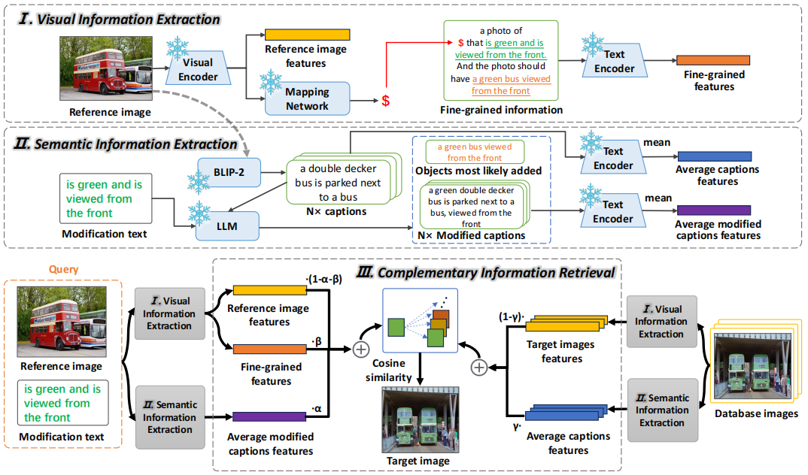

# CVSI (ICDM 2025)
### Fine-Grained Zero-Shot Composed Image Retrieval with Complementary Visual-Semantic Integration

🚀🚀🚀 [2025/10/28] We have released the complete code and corresponding mapping network model weights. After executing the code and completing the generation, retrieval can be performed.

---

## Overview



### Abstract

Zero-shot composed image retrieval (ZS-CIR) is a rapidly growing area with significant practical applications, allowing users to retrieve a target image by providing a reference image and a relative caption describing the desired modifications. Existing ZS-CIR methods often struggle to capture fine-grained changes and integrate visual and semantic information effectively. They primarily rely on either transforming the multimodal query into a single text using image-to-text models or employing large language models for target image description generation, approaches that often fail to capture complementary visual information and complete semantic context. To address these limitations, we propose a novel Fine-Grained Zero-Shot Composed Image Retrieval method with Complementary Visual-Semantic Integration (CVSI). Specifically, CVSI leverages three key components: (1) Visual Information Extraction, which not only extracts global image features but also uses a pre-trained mapping network to convert the image into a pseudo token, combining it with the modification text and the objects most likely to be added. (2) Semantic Information Extraction, which involves using a pre-trained captioning model to generate multiple captions for the reference image, followed by leveraging an LLM to generate the modified captions and the objects most likely to be added. (3) Complementary Information Retrieval, which integrates information extracted from both the query and database images to retrieve the target image, enabling the system to efficiently handle retrieval queries in a variety of situations. Extensive experiments on three public datasets (e.g., CIRR, CIRCO, and FashionIQ) demonstrate that CVSI significantly outperforms existing state-of-the-art methods.

---

## Getting Started

### Installation

1. Clone the repository

2. Install Python dependencies

```sh
conda create -n CVSI -y python=3.8
conda activate CVSI
pip install -r requirements.txt
```

### Required Datasets

All datasets should be placed in the ./data directory.

#### FashionIQ

Download the FashionIQ dataset following the instructions in
the [**official repository**](https://github.com/XiaoxiaoGuo/fashion-iq). 
After downloading the dataset, ensure that the folder structure matches the following:

```
├── FASHIONIQ
│   ├── captions
|   |   ├── cap.dress.[train | val | test].json
|   |   ├── cap.toptee.[train | val | test].json
|   |   ├── cap.shirt.[train | val | test].json

│   ├── image_splits
|   |   ├── split.dress.[train | val | test].json
|   |   ├── split.toptee.[train | val | test].json
|   |   ├── split.shirt.[train | val | test].json

│   ├── images
|   |   ├── [B00006M009.jpg | B00006M00B.jpg | B00006M6IH.jpg | ...]
```

#### CIRR

Download the CIRR dataset following the instructions in the [**official repository**](https://github.com/Cuberick-Orion/CIRR).
After downloading the dataset, ensure that the folder structure matches the following:

```
├── CIRR
│   ├── train
|   |   ├── [0 | 1 | 2 | ...]
|   |   |   ├── [train-10108-0-img0.png | train-10108-0-img1.png | ...]

│   ├── dev
|   |   ├── [dev-0-0-img0.png | dev-0-0-img1.png | ...]

│   ├── test1
|   |   ├── [test1-0-0-img0.png | test1-0-0-img1.png | ...]

│   ├── cirr
|   |   ├── captions
|   |   |   ├── cap.rc2.[train | val | test1].json
|   |   ├── image_splits
|   |   |   ├── split.rc2.[train | val | test1].json
```

#### CIRCO

Download the CIRCO dataset following the instructions in the [**official repository**](https://github.com/miccunifi/CIRCO).
After downloading the dataset, ensure that the folder structure matches the following:

```
├── CIRCO
│   ├── annotations
|   |   ├── [val | test].json

│   ├── COCO2017_unlabeled
|   |   ├── annotations
|   |   |   ├──  image_info_unlabeled2017.json
|   |   ├── unlabeled2017
|   |   |   ├── [000000243611.jpg | 000000535009.jpg | ...]
```

### Required Mapping Network

Download the mapping network from the following Google Drive link: https://drive.google.com/drive/folders/1yX9qxhwTcjgEPcjybTnS3m3fV47a-p3Z?usp=sharing
After downloading, place the mapping network files in the ./phi_model directory. Ensure the directory structure is maintained as follows:

```
phi_model
    ├── phi_best_base_openai.pt
    ├── phi_best_large_openai.pt
    ├── phi_best_giga_openclip.pt
```

This ensures that the mapping network files are placed correctly, and the directory structure is ready for the codebase to use.

---

## Evaluating CVSI on all Datasets

To facilitate the evaluation of CVSI on different datasets, we provide a simple execution script. You can simply run the `code_execution.sh` script to evaluate CVSI on all datasets using different backbone models.

The script supports the following backbone models:
- **ViT-B/32** (OpenAI CLIP Base)
- **ViT-L/14** (OpenAI CLIP Large)
- **ViT-bigG-14** (OpenCLIP Giga)

The script will automatically evaluate on the following datasets:
- **CIRCO** (test split)
- **CIRR** (test split)
- **FashionIQ** (shirt, dress, toptee - val split)

### Usage

Simply execute the following command in your terminal:

```bash
bash code_execution.sh
```

The script will execute all dataset and backbone combinations sequentially. You can also modify the `code_execution.sh` file to select specific datasets or backbones for evaluation.

### Running Individual Configurations

If you want to run a specific dataset and backbone combination individually, you can refer to the command examples in `code_execution.sh`. For example:

```bash
# Evaluate on CIRCO dataset using ViT-B/32 backbone
python main.py --dataset circo --split test --dataset-path data/CIRCO --llm_prompt prompts.structural_modifier_prompt --clip ViT-B/32
```

---

## License

For detailed license information and copyright notices, please refer to [LICENSE](LICENSE) and [NOTICE.md](NOTICE.md).

